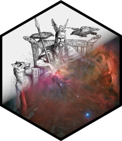

# odin.dust 

<!-- badges: start -->

<!-- badges: end -->

Compile an [odin](https://mrc-ide.github.io/odin/) model to work with [dust](https://mrc-ide.github.io/dust/), so that a stochastic model can be run in parallel, for example in a particle filter such as [mcstate](https://mrc-ide.github.io/mcstate/).

This works only for models that are discrete time, and makes sense only for models that are stochastic. Within these models you cannot use `output()`, interpolation functions or delays. Not all distributions are supported by dust.
See `vignette("porting")` for details.

## License

MIT © Imperial College of Science, Technology and Medicine
